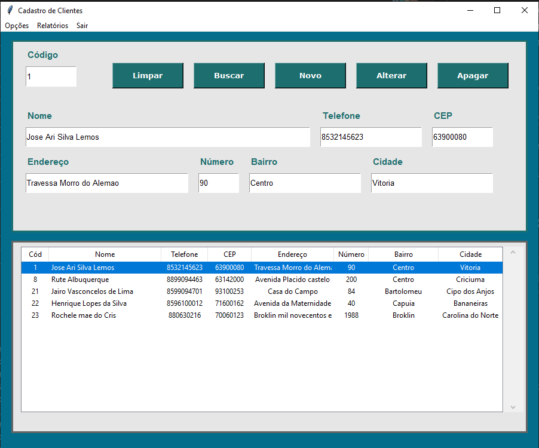
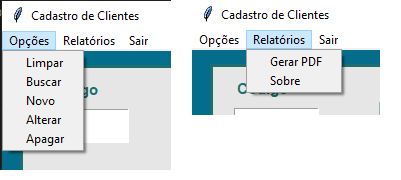
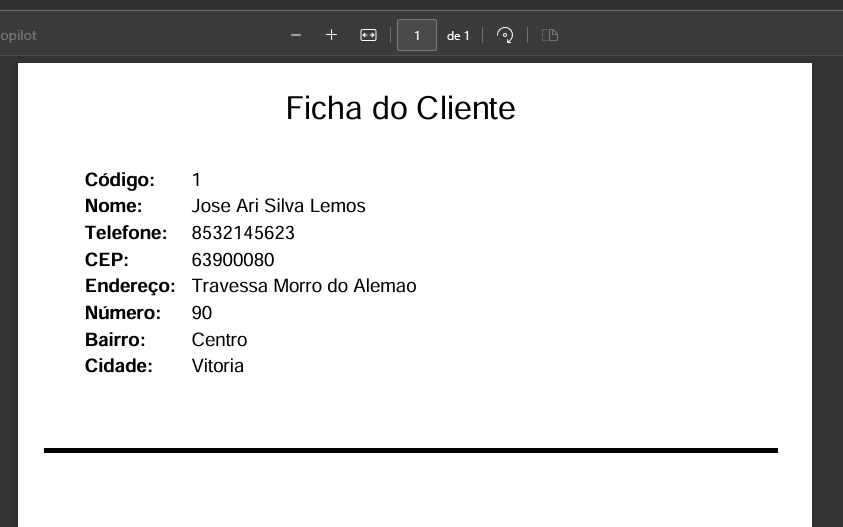

# Cadastro de Clientes - Desktop

## Descrição do Projeto
Este projeto é um **sistema de cadastro de clientes** desenvolvido em **Python** utilizando a biblioteca **Tkinter** para interface gráfica, **SQLite** como banco de dados local e **ReportLab** para geração de relatórios em PDF. O sistema permite cadastrar, alterar, excluir, buscar clientes e gerar relatórios individuais em PDF.

## Tela





---

## Funcionalidades

- **Cadastro de Clientes:** Inserção de dados como código, nome, telefone, CEP, endereço, número, bairro e cidade.
- **Alteração de Dados:** Atualização das informações de um cliente existente.
- **Exclusão de Clientes:** Remoção de registros pelo código do cliente.
- **Busca e Listagem:** Consulta e exibição de todos os clientes cadastrados em uma tabela.
- **Geração de PDF:** Criação de relatório individual de clientes em PDF.
- **Interface Intuitiva:** Botões e campos de entrada organizados em um layout limpo e funcional.

---

## Tecnologias Utilizadas

- **Python 3.7+**
- **Tkinter** - Para criação da interface gráfica.
- **SQLite** - Banco de dados local para armazenamento dos clientes.
- **ReportLab** - Biblioteca para geração de PDFs.
- **Webbrowser** - Para abrir o PDF gerado automaticamente.

---

## Estrutura do Projeto

├── main.py     - Arquivo principal com toda a aplicação

├── clientes.db - Banco de dados SQLite (gerado automaticamente)

├── cliente.pdf - Relatório PDF (gerado pelo sistema)


---

## Como Executar

1. **Instalar dependências**
   
   É necessário ter Python instalado e as bibliotecas Tkinter (já inclusa no Python), SQLite (integrada) e ReportLab.

Para instalar o ReportLab:
```bash
pip install reportlab


python main.py
```

---

# Uso

- Preencha os campos do formulário.

- Clique em Novo para adicionar o cliente.

- Use Alterar ou Apagar para editar ou remover registros.

- Clique duas vezes em um cliente na lista para preencher os campos com os dados selecionados.

- Acesse Relatórios → Gerar PDF para criar o relatório do cliente selecionado.

---
# Observações

- O banco de dados clientes.db é criado automaticamente na primeira execução do programa.

- Os relatórios em PDF são salvos com o nome cliente.pdf e podem ser abertos automaticamente.

- A interface é responsiva e ajustável, permitindo redimensionamento da janela principal.

---
## Autor
Este projeto foi desenvolvido por **Ari Junior**

- **LinkedIn:** https://www.linkedin.com/in/arijunior09/
- **GitHub:** https://github.com/AriJunior09